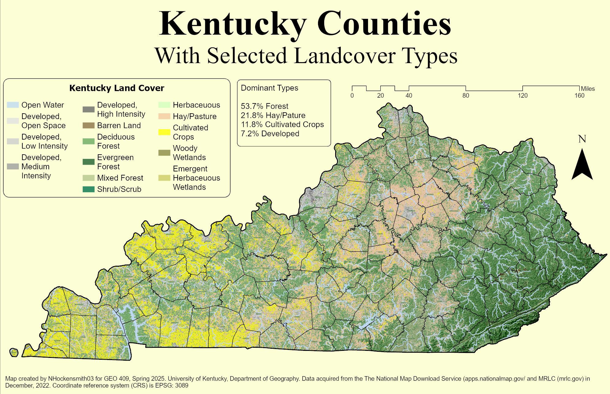
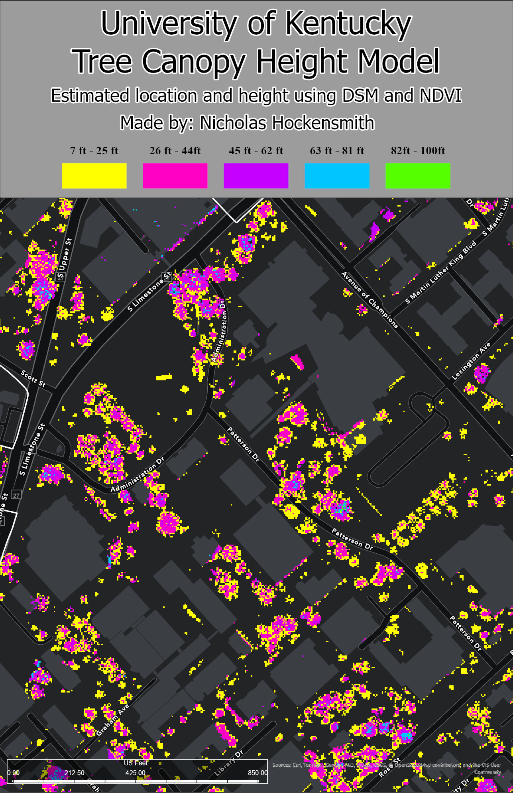

# GEO409 Lab_4
This Webpage contains a landcover map of kentucky with counties along with a map of tree hight located on central campus of the University of Kentucky.

## Kentucky Landcover 
This is a map of Kentucky Counties with their landcover types

   
Kentucky counties with selected land cover types – [Download geospatial PDF](Layout_KY_LandCover.pdf)

## University of Kentucky Tree Canopy
Map for field trip to measure tree canopy

   
UKy central campus canopy model – [Download geospatial PDF](Layout_TreeCanopyModel.pdf)

Maps created by NHockensmith03 for GEO409, Spring 2025, University of Kentucky Department of Geography
